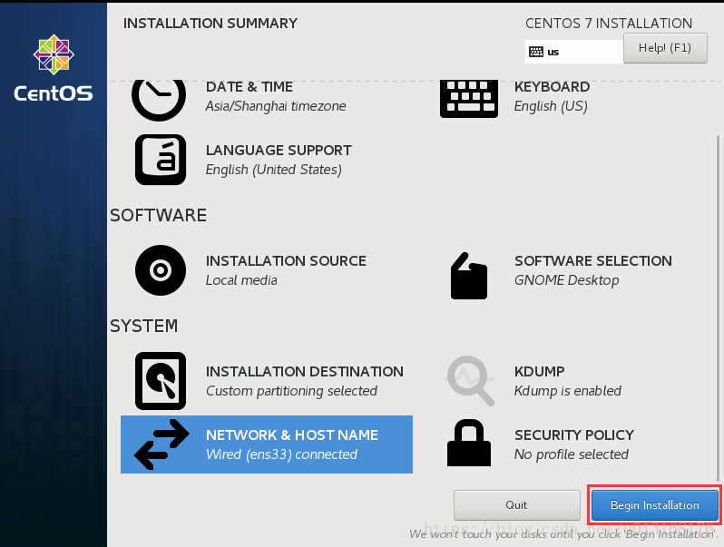

### Linux

#### 分区

- /boot   linux启动的引导文件200m
- 


### Linux命令

| 命令                                                         | 说明                                      |
| ------------------------------------------------------------ | ----------------------------------------- |
| touch aa.txt/aa.md/aa                                        | 建立一个文件aa.txt/aa.md                  |
| yy                                                           | vim正常模式下复制当前行                   |
| dd                                                           | vim正常模式下删除当前行                   |
| :set nu                                                      | vim 命令模式下设置行号                    |
| :set nonu                                                    | vim 命令模式下不显示行号                  |
| /关键字   输n找到下一个匹配项                                | vim 命令行模式下查找                      |
| gg                                                           | vim正常模式下回到首行                     |
| G                                                            | vim正常模式下回到末尾                     |
| u                                                            | vim正常模式下撤销编辑模式所做的上一个修改 |
|                                                              |                                           |
| gzip                                                         | 压缩文件，不保留源文件                    |
| gunzip                                                       | 解压文件，不保留源文件                    |
| zip 选项  压缩名xxx.zip 压缩内容<br />       选项：-r：递归压缩，即整个目录 | 压缩文件，保留源文件un                    |
| unzip 选项 解压路径 压缩名xxx.zip <br />       选项：-d：解压缩，存放的路径 | 解压缩文件，保留源文件                    |
| tar 选项 合并名称xx.tar.gz  文件a 文件b <br />       选项：-zcvf：打包 | tar指令打包                               |
| tar 选项 合并名称xx.tar.gz  文件a 路径 <br />       选项：-zcvf：打包 | tar指令打包一个文件                       |
| tar 选项 解压名称xx.tar.gz   <br />       选项：-zxvf：解压  | tar指令解压                               |
| tar 选项 解压名称xx.tar.gz  -C 指定目录（必须存在）  <br />       选项：-zxvf：解压 | tar指令解压                               |
|                                                              |                                           |

### 其它

| 内容                      | shuom              |
| ------------------------- | ------------------ |
| ftp                       | 默认监听21号端口   |
| sftp                      | 默认监听22号端口   |
| /etc/profile              | 配置环境变量       |
| /etc/sysconfig/iptables   | 虚拟机配置端口放行 |
| telnet ip                 | 测试连接           |
| service iptables status   | 显示放行端口       |
| find / -name  'file name' | 以文件名查找文件   |
|                           |                    |
|                           |                    |


# centos7安装

1、选择：1）典型推荐--->2 )稍后安装操作系统--->3 ) 选择操作系统（centos 64）--->5 ) 取名和选取虚拟空间存储位置 ---> 6)磁盘大小20G，虚拟磁盘划分为多个文件--->7 )完成

2、编辑虚拟机设置：1） 内存：2G   

​									 2) 处理器：选择：2-2（1cpu俩核）

​									 3）网络适配器：桥接模式（勾选复制网络连接状态---复制本机网卡信息到虚拟机，让虚拟机网卡充当真实网卡）

​											1、桥接模式：可以与一个局域网通讯，但会造成ip冲突

​											 2、 NAT模式：linux里可以访问外网，不会造成ip冲突，但本机所在的局域网不能访问linux（使用NAT后本机还出现一个ip与linux的ip构成一个网段，linux访问外网可使用本机ip代理出去）

​											 3、本机模式：独立的ip不能访问外网


系统安装过程

1、加载光盘启动后，默认选择的是第二项，这里我们需要按↑键，将选项调到第一项Install CentOS7,再按enter键。


2、语言选项，可通过左侧搜索语言，这里默认选择English，点击Continue进行下一步


3、设置日期和时间,选择DATE&TIME


时区选择Asia/Shanghai，可通过搜索框直接搜索或在世界地图中选中即可

下方时间和日期需要调整到跟当前时区一致，然后点击左上方Done进行下一步。


4、选择安装软件包,选择SOFTWARE SELECTION


对于初学者选择GNOME Desktop使用即可，点击Done进行下一步(我选择默认的minimal)


5、系统安装位置，选择INSTALLATION DESTINATION


选择下方I will configure partitioning（我将配置分区），也即自定义磁盘分区，点击Done进行下一步


默认分区格式为lvm，在下拉列表中选择Standard Partition（标准分区），点击下方“+”号开始创建分区


此次系统磁盘分区大小如下所示：

/boot        1G      系统启动引导分区，1G够用

/               50G   根分区，可根据需求分大小

/date        30G   自建分区，做实验用，可不分

swap        3G    交换分区，一般为内存2倍，内存为1.5G，因此swap分区大小为3G

剩余空间大小可留作实验用，后面再分即可。

创建/boot分区

在Mount Point下拉列表中选择/boot，分区大小单位可自定义设置，这里以G为单位，设置分区大小为1G，设置完毕后，点击Add Mount Point完成创建分区。


创建/（根）分区


创建/data分区

这里/data分区在Mount Point下拉列表中不存在，需要手动输入/data。


创建swap分区


分区创建完毕，查看分区大小是否与需求一致，点击Done进行下一步


将分区结果显示出来，选择Accept Change。


6、网络、主机名设置，选择NETWORK&HOST NAME


选中网卡Ethernet（ens33），将右侧按钮OFF改为ON

下方Host name可根据需要进行更改，更改完以后点击右侧Apply应用按钮，最后点击Done进行下一步。


7、开始系统安装，点击Begin Installing



8、设置管理员密码，选择ROOT PASSWORD


设置并确认管理员密码，点击Done完成设置


9、创建普通用户，选择USER CREATION（可在linux自己创建）


设置普通用户账号和密码，点击Done完成设置。设置完成以后，等待系统安装。


10、系统安装完毕，点击Reboot重启


网络配置：

有关于centos7获取IP地址的方法主要有两种，1：动态获取ip；2：设置静态IP地址

在配置网络之前我们先要知道centos的网卡名称是什么，centos7不再使用ifconfig命令，可通过命令 IP addr查看，如图，网卡名为ens32，是没有IP地址的


**1、动态获取ip**（前提是你的路由器已经开启了DHCP）

修改网卡配置文件 vi /etc/sysconfig/network-scripts/ifcfg-**ens32**    (最后一个为网卡名称)

动态获取IP地址需要修改两处地方即可

（1）bootproto=dhcp

（2）onboot=yes


修改后重启一下网络服务即可 systemctl restart network

```
[root@mini ~]# systemctl restart network
[root@mini ~]# 
```

这样动态配置IP地址就设置好了，这个时候再查看一下ip addr 就可以看到已经获取了IP地址，且可以上网（ping 百度）


 

**2、配置静态IP地址**

设置静态IP地址与动态iIP差不多，也是要修改网卡配置文件 vi /etc/sysconfig/network-scripts/ifcfg-ens32    (最后一个为网卡名称)

##### 配置如下


（1）bootproto=static

（2）onboot=yes

（3）在最后加上几行，IP地址、子网掩码、网关、dns服务器

```
IPADDR=192.168.1.160
NETMASK=255.255.255.0
GATEWAY=192.168.1.1
DNS1=119.29.29.29
DNS2=8.8.8.8
```

（4）重启网络服务

```
[root@mini ~]# systemctl restart network
[root@mini ~]# 
```

DNS服务器可以只配一个，我用的是两个免费的dns服务器，查看IP地址，测试联网


```
[root@mini ~]# ip addr
1: lo: <LOOPBACK,UP,LOWER_UP> mtu 65536 qdisc noqueue state UNKNOWN group default qlen 1000
    link/loopback 00:00:00:00:00:00 brd 00:00:00:00:00:00
    inet 127.0.0.1/8 scope host lo
       valid_lft forever preferred_lft forever
    inet6 ::1/128 scope host
       valid_lft forever preferred_lft forever
2: ens32: <BROADCAST,MULTICAST,UP,LOWER_UP> mtu 1500 qdisc pfifo_fast state UP group default qlen 1000
    link/ether 00:0c:29:d2:42:55 brd ff:ff:ff:ff:ff:ff
    inet 192.168.1.160/24 brd 192.168.1.255 scope global noprefixroute ens32
       valid_lft forever preferred_lft forever
    inet6 fe80::f86e:939e:ff9b:9aec/64 scope link noprefixroute
       valid_lft forever preferred_lft forever
[root@mini ~]# ping www.baidu.com
PING www.a.shifen.com (163.177.151.109) 56(84) bytes of data.
64 bytes from 163.177.151.109 (163.177.151.109): icmp_seq=1 ttl=55 time=27.5 ms
64 bytes from 163.177.151.109 (163.177.151.109): icmp_seq=2 ttl=55 time=35.2 ms
^C
--- www.a.shifen.com ping statistics ---
2 packets transmitted, 2 received, 0% packet loss, time 1008ms
rtt min/avg/max/mdev = 27.570/31.425/35.281/3.859 ms
```

**3、永久关闭防火墙**

**systemctl disable firewalld**

**chkconfig iptables off**

## 安装docker（环境的安装，redis，mysql等）

#### 一，Docker简介

百科说：Docker 是一个开源的应用容器引擎，让开发者可以打包他们的应用以及依赖包到一个可移植的容器中，然后发布到任何流行的[Linux](https://baike.baidu.com/item/Linux)机器上，也可以实现虚拟化，容器是完全使用沙箱机制，相互之间不会有任何接口。

看起来有点雾，用过虚拟机的应该对虚拟化技术有点印象，不知道也没关系，就把它当成轻量级的虚拟机吧（虽然一个是完全虚拟化，一个是操作系统层虚拟化），这个解释到位：https://www.cnblogs.com/kex1n/p/6933039.html

百科又说：Docker 使用客户端-服务器 (C/S) 架构模式 使用远程API来管理和创建Docker容器。Docker 容器（Container）通过 Docker 镜像（Image）来创建，二者之间的关系类似于面向对象编程中的对象与类

那Docker由什么组成呢， 包括三个基本概念:

- **仓库（Repository）**

- **镜像（Image）**

- **容器(Container）**

打个比方：你如果想玩英雄联盟中骚气的亚索，你首先得有这个英雄（Docker的镜像），然后你得花金币去英雄商店（Docker的仓库）买，接着进游戏就会看到一个半蹲的发型飘逸的剑客（Docker的容器），所以：

1，其中Registry是Docker用于存放镜像文件的仓库，Docker 仓库的概念跟Git 类似（就像商店存放所有的英雄，只是更改英雄的权限在某些非程序员手里）。

2，所谓镜像就是构建容器的源代码，是一个只读的模板，由一层一层的文件系统组成的，类似于虚拟机的镜像（英雄也是只读的，有自己的技能被动，你也不能进行操作）。

3，那么容器就是由Docker镜像创建的运行实例，类似于虚拟机，容器之间是相互隔离的，包含特定的应用及其所需的依赖文件（好比每个英雄都是隔离的，都有自己的皮肤，技能以及走的路线)。

   **注：**[`Docker Hub`](https://hub.docker.com/)是Docker公司提供的一个注册服务器（Register）来保存多个仓库，每个仓库又可以包含多个具备不同tag的镜像

#### 二，安装Docker

我是虚拟机装的Centos7，linux 3.10 内核，docker官方说至少3.8以上，建议3.10以上（ubuntu下要linux内核3.8以上， RHEL/Centos 的内核修补过， centos6.5的版本就可以——这个可以试试）

1，root账户登录，查看内核版本如下

```
[root@localhost ~]# uname -a
Linux localhost.qgc 3.10.0-862.11.6.el7.x86_64 #1 SMP Tue Aug 14 21:49:04 UTC 2018 x86_64 x86_64 x86_64 GNU/Linux
```

2，把yum包更新到最新(很多朋友说更新yum有问题，可以不更新试试，更新于2019年10月30日)

[](javascript:void(0);)

```
[root@localhost ~]# yum update
已加载插件：fastestmirror, langpacks
Loading mirror speeds from cached hostfile
 * base: centos.ustc.edu.cn
 * extras: mirrors.aliyun.com
 * updates: centos.ustc.edu.cn
正在解决依赖关系
--> 正在检查事务
---> 软件包 bind-libs.x86_64.32.9.9.4-61.el7 将被 升级
---> 软件包 bind-libs.x86_64.32.9.9.4-61.el7_5.1 将被 更新
---> 软件包 bind-libs-lite.x86_64.32.9.9.4-61.el7 将被 升级
---> 软件包 bind-libs-lite.x86_64.32.9.9.4-61.el7_5.1 将被 更新
---> 软件包 bind-license.noarch.32.9.9.4-61.el7 将被 升级
---> 软件包 bind-license.noarch.32.9.9.4-61.el7_5.1 将被 更新......
验证中 : 32:bind-license-9.9.4-61.el7.noarch 8/8

更新完毕:
bind-libs.x86_64 32:9.9.4-61.el7_5.1
bind-libs-lite.x86_64 32:9.9.4-61.el7_5.1
bind-license.noarch 32:9.9.4-61.el7_5.1
bind-utils.x86_64 32:9.9.4-61.el7_5.1

完毕！
[root@localhost ~]#
```

3，安装需要的软件包， yum-util 提供yum-config-manager功能，另外两个是devicemapper驱动依赖的

```
[root@localhost ~]# yum install -y yum-utils device-mapper-persistent-data lvm2
已加载插件：fastestmirror, langpacks
Loading mirror speeds from cached hostfile
 * base: centos.ustc.edu.cn
 * extras: mirrors.aliyun.com
 * updates: centos.ustc.edu.cn
...
```

4，设置yum源

```
[root@localhost ~]# yum-config-manager --add-repo https://download.docker.com/linux/centos/docker-ce.repo

已加载插件：fastestmirror, langpacks
adding repo from: https://download.docker.com/linux/centos/docker-ce.repo
grabbing file https://download.docker.com/linux/centos/docker-ce.repo to /etc/yum.repos.d/docker-ce.repo
repo saved to /etc/yum.repos.d/docker-ce.repo
```

5、更新yum缓存

```
[root@localhost ~]# sudo yum makecache fast
```


6，可以查看所有仓库中所有docker版本，并选择特定版本安装

```
[root@localhost ~]# yum list docker-ce --showduplicates | sort -r
已加载插件：fastestmirror, langpacks
可安装的软件包
 * updates: centos.ustc.edu.cn
Loading mirror speeds from cached hostfile
 * extras: mirrors.aliyun.com
docker-ce.x86_64            18.06.1.ce-3.el7                    docker-ce-stable
docker-ce.x86_64            18.06.0.ce-3.el7                    docker-ce-stable
docker-ce.x86_64            18.03.1.ce-1.el7.centos             docker-ce-stable
docker-ce.x86_64            18.03.0.ce-1.el7.centos             docker-ce-stable
docker-ce.x86_64            17.12.1.ce-1.el7.centos             docker-ce-stable
docker-ce.x86_64            17.12.0.ce-1.el7.centos             docker-ce-stable
...
```


7，安装Docker，命令：yum install docker-ce-版本号，我选的是17.12.0.ce，如下

```
[root@localhost ~]# yum install docker-ce-17.12.0.ce  #由于repo中默认只开启stable仓库，故这里安装的是最新稳定版17.12.0

已加载插件：fastestmirror, langpacks
Loading mirror speeds from cached hostfile
 * base: centos.ustc.edu.cn
 * extras: mirrors.aliyun.com
 * updates: centos.ustc.edu.cn
base                                                   | 3.6 kB     00:00     
docker-ce-stable                                       | 2.9 kB     00:00     
extras                                                 | 3.4 kB     00:00     
updates                                                | 3.4 kB     00:00     
正在解决依赖关系
--> 正在检查事务
---> 软件包 docker-ce.x86_64.0.17.12.1.ce-1.el7.centos 将被 安装
--> 正在处理依赖关系 container-selinux >= 2.9，它被软件包 docker-ce-17.12.1.ce-1.el7.centos.x86_64 需要...
```


8， 启动Docker，命令：systemctl start docker，然后加入开机启动，如下

```
[root@localhost ~]# systemctl start docker
[root@localhost ~]# systemctl enable docker
Created symlink from /etc/systemd/system/multi-user.target.wants/docker.service to /usr/lib/systemd/system/docker.service.
```


9，验证安装是否成功(有client和service两部分表示docker安装启动都成功了)

```
[root@localhost ~]# docker version 
Client:
 Version:    17.12.1-ce
 API version:    1.35
 Go version:    go1.9.4
 Git commit:    7390fc6
 Built:    Tue Feb 27 22:15:20 2018
 OS/Arch:    linux/amd64
Server:
 Engine:
  Version:    17.12.1-ce
  API version:    1.35 (minimum version 1.12)
  Go version:    go1.9.4
  Git commit:    7390fc6
  Built:    Tue Feb 27 22:17:54 2018
  OS/Arch:    linux/amd64
  Experimental:    false
```

#### docker命令

1、 docker ps		//查看当前容器

2、 docker search name   //查看对应的镜像版本

3、docker pull name:version   //拉取对应的版本镜像   latest为最新版本

3、docker images   //查看本地镜像

4、docker start 容器ID	//开启容器

5、docker stop 容器ID或容器名
			参数 -t：关闭容器的限时，如果超时未能关闭则用kill强制关闭，默认值10s，这个时间用于容器的自己保存状态
			docker stop -t=60 容器ID或容器名

6、docker kill 容器ID或容器名 :直接关闭容器


#### docker安装mysql

#### 安装pip

```
sudo yum -y install epel-release 
sudo yum -y install python-pip

//////////////////////////////////
什么是EPEL 及 Centos上安装EPEL
-------

什么是EPEL 及 Centos上安装EPEL

RHEL以及他的衍生发行版如CentOS、Scientific Linux为了稳定，官方的rpm repository提供的rpm包往往是很滞后的，当然了，这样做这是无可厚非的，毕竟这是服务器版本，安全稳定是重点，官方的rpm repository提供的rpm包也不够丰富，很多时候需要自己编译那太辛苦了，而EPEL恰恰可以解决这两方面的问题。

什么是EPEL?

EPEL的全称叫 Extra Packages for Enterprise Linux 。EPEL是由 Fedora 社区打造，为 RHEL 及衍生发行版如 CentOS、Scientific Linux 等提供高质量软件包的项目。装上了 EPEL之后，就相当于添加了一个第三方源。

如果你知道rpmfusion.org的话，拿 rpmfusion 做比较还是很恰当的，rpmfusion 主要为桌面发行版提供大量rpm包，而EPEL则为服务器版本提供大量的rpm包，而且大多数rpm包在官方 repository 中是找不到的。

另外一个特点是绝大多数rpm包要比官方repository 的rpm包版本要来得新，比如我前些日子在CentOS上安装的php，RHEL为了稳定性还在延用5.1.6版，我记得这是去年上半年的版本，而php 的最新版本已经到5.3.2，如果在php5.1.6的基础上安装phpmyadmin，则会提示php版本过低，这时候，EPEL中提供的较新php rpm就能很方便的派上用场了。

 

 

===================================

 

一，什么是epel 如果既想获得 RHEL 的高质量、高性能、高可靠性，又需要方便易用(关键是免费)的软件包更新功能，那么 Fedora Project 推出的 EPEL(Extra Packages for Enterprise Linux)正好适合你。EPEL(http://fedoraproject.org/wiki/EPEL) 是由 Fedora 社区打造，为 RHEL 及衍生发行版如 CentOS、Scientific Linux 等提供高质量软件包的项目。

 二，使用心得 1，不用去换原来yum源，安装后会产生新repo  2，epel会有很多源地址，如果一个下不到，会去另外一个下 http://mirror.xfes.ru/fedora-epel/6/x86_64/ibus-table-chinese-scj-1.3.4-1.el6.noarch.rpm: [Errno 14] PYCURL ERROR 6 - "" Trying other mirror.  http://mirrors.ustc.edu.cn/fedora/epel/6/x86_64/ibus-table-chinese-scj-1.3.4-1.el6.noarch.rpm: [Errno 14] PYCURL ERROR 6 - ""  Trying other mirror.  http://repo.boun.edu.tr/epel/6/x86_64/ibus-table-chinese-scj-1.3.4-1.el6.noarch.rpm: [Errno 14] PYCURL ERROR 6 - ""kjs  3，更新时如果下载的包不全，就不会进行安装。这样的话，依赖关系可以保重

 三，安装epel,centos6选6，5就选5  32位系统选择：

rpm -ivh http://dl.fedoraproject.org/pub/epel/6/i386/epel-release-6-8.noarch.rpm  rpm -ivh http://dl.fedoraproject.org/pub/epel/5/i386/epel-release-5-4.noarch.rpm  64位系统选择： rpm -ivh http://dl.fedoraproject.org/pub/epel/6/x86_64/epel-release-6-8.noarch.rpm  rpm -ivh http://dl.fedoraproject.org/pub/epel/5/x86_64/epel-release-5-4.noarch.rpm

导入key： rpm --import /etc/pki/rpm-gpg/RPM-GPG-KEY-EPEL-6  rpm --import /etc/pki/rpm-gpg/RPM-GPG-KEY-EPEL-5 如果用比较新的软件，

用epel-test.repo这个文件就行了  别忘了安装yum install yum-priorities

 

[root@localhost yum.repos.d]# ls |grep epel  epel.repo  epel-testing.repo

默认yum源(软件仓库):base+extras+updates

国内yum源http://mirrors.aliyun.com/help/centos

扩展yum源:方法一: 通过访问阿里yum源镜像地址获取.

        方法二:直接安装epel源方式:yum install epel-release
```

##### 安装步骤

1. docker search mysql

2. docker pull mysql:5.7

3. docker images

4. 安装完成后，我们可以使用以下命令来运行 mysql 容器：

   ```
   $ docker run -d --name mysql-test -p 3306:3306 -e MYSQL_ROOT_PASSWORD=123456 mysql
   
   注：-p 3306:3306：将容器的3306端口映射到主机的3306端口
   -v /opt/docker_v/mysql/conf:/etc/mysql/conf.d：将主机/opt/docker_v/mysql/conf目录挂载到容器的/etc/mysql/conf.d
   -e MYSQL_ROOT_PASSWORD=123456：初始化root用户的密码
   -d: 后台运行容器，并返回容器ID
   imageID: mysql镜像ID
   -idt ：自定义开启镜像名mysql5.7
   --name ：开启镜像是哪个如mysql
   ```

##### 远程连接mysql报错1251错误

```
首先进入

 1、docker exec -it mysql02 bash      //mysql02是mysql容器的别名

  2、mysql -uroot -p  

  3、输入密码

  4、进入mysql>命令行界面

1,容器中登录mysql,查看mysql的版本

mysql> status;
--------------

mysql  Ver 8.0.11 for Linux on x86_64 (MySQL Community Server - GPL)

 

2,进行授权远程连接(注意mysql 8.0跟之前的授权方式不同)

授权

GRANT ALL ON *.* TO 'root'@'%';

刷新权限

flush privileges;

此时,还不能远程访问,因为Navicat只支持旧版本的加密,需要更改mysql的加密规则

 

3,更改加密规则

ALTER USER 'root'@'localhost' IDENTIFIED BY 'password' PASSWORD EXPIRE NEVER;

 

4,更新root用户密码(设置Navicat的登录密码)

ALTER USER 'root'@'%' IDENTIFIED WITH mysql_native_password BY 'password';

注意：‘%’代表任意IP都可以进行数据库的访问
	 root是mysql的root用户
	 password是mysql的root用户密码

刷新权限

flush privileges;

OK，设置完成，再次使用 Navicat 连接数据库
```


#### 安装node

##### 一、安装步骤

1、将安装包上传到指定位置(我习惯放到：/usr/local/application/目录)，并解压

```
1 tar -xvf node-v10.6.0-linux-x64.tar.xz
```

2、重命名文件夹

```
1 mv node-v10.6.0-linux-x64 nodejs
```

3、通过建立软连接变为全局

```
1 ln -s $PATH/nodejs/bin/npm /usr/local/bin/
2 ln -s $PATH/nodejs/bin/node /usr/local/bin/

$PATH:安装路径
```

4、检查是否安装成功，命令：node-v

```
1 node -v
2 v10.6.0
```

