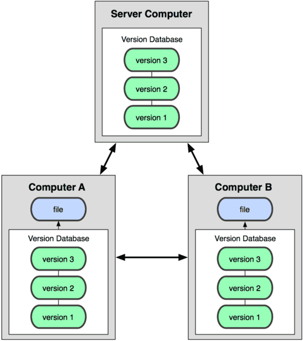
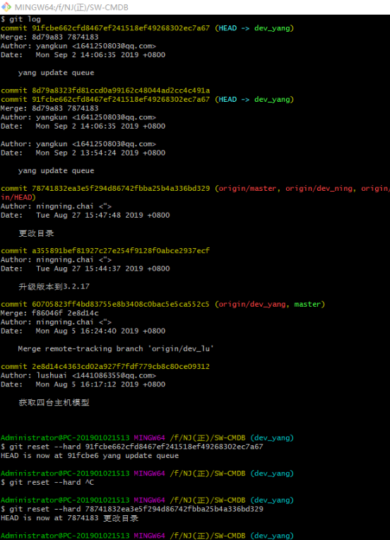

### git原理

早期出现的版本控制系统有：SVN、CVS等，它们是集中式版本控制系统，都有一个单一的集中管理

的服务器，保存所有文件的修订版本，而协同合作的开发人员都通过客户端连接到这台服务器，取出

最新的文件或者提交更新。


 Git 是分布式版本控制系统。

集中式版本控制系统，版本库是集中存放在中央服务器的，工作的时候，用的是自己的电脑，所以，我们首先需要

从中央服务器上拉取最新的版本，然后开始工作，等工作完了，再把自己的工作提交到中央服务器。在这里借用廖

雪峰老师的一个比喻，中央服务器好比是一个图书馆，你要改其中的一本书，必须先要从图书馆里把书借出来，然

后更改，改完之后，再放回图书馆。

集中式版本控制系统的一个最大毛病就是必须联网才能工作，所以对于网络环境比较差的情况使用集中式版本控制

系统是一件比较让人头疼的事情。

 

分布式版本控制系统没有中央服务器的概念，我们使用相关的客户端提取的不只是最新的文件，而是把代码仓库完整

地镜像下来，相当于每个人的电脑都是一个完整的版本库，这样的话，任何一处协同工作的服务器出现故障，都可以

用任何一个镜像出来的本地仓库恢复。并且，即便在网络环境比较差的情况下也不用担心，因为版本库就在本地电脑

上。

 

个人总结：

(1).分布式版本控制系统下的本地仓库包含代码库还有历史库，在本地就可以查看版本历史

(2).而集中式版本控制系统下的历史仓库是存在于中央仓库，每次对比与提交代码都必须连接到中央仓库

(3).多人开发时，如果充当中央仓库的Git仓库挂掉了，任何一个开发者都可以随时创建一个新的中央仓库然后同步就可

以恢复中央仓库

从网上找了一张图，展示一下它们的原理



*** 简而言之：git拉取的代码都存储在本地git仓库中其相当于中央仓库，做的一切修改都只是对本地仓库的修改，只有在完成修改时提交（push）自己本地的仓库代码（push分支）即可。

### git 提交代码

```
1、git clone https://github.com/oykaiwyh/test.git

2、git branch yy    //创建yy的本地分支

3、git checkout yy		//选中本地分支yy

4、git push origin yy           //以本地yy分支为准，创建yy的远程分支

5、对拉取的项目进行CRUD   

6、git status     //查看修改过的代码

7、git add .                  //添加所有的修改内容进入缓存区

8、git commit -m '修改注释'    //提交修改到仓库

9、git pull origin master	//拉取最新代码到本地yy分支上

10、git push --set-upstream origin yy   	//设置本地分支追踪远程分支yy，只使用一次，之后直接使用git push即可
```

### git本地命令合并仓库分支

```
//git 本地合并到主分支
1. git checkout master
2.git merge 子分支
3.git push origin  //合并到主分支
```

### git命令

```
1.git branch -r  						//查看远程分支
2.git pull origin master  				//拉取远程最新信息到本地分支
3.git branch							//查看本地分支
4.git checkout  'originname' 			//切换分支到‘originname’
5.git branch -r							//查看远程分支
6.git branch -d 'originname'			//删除本地分支'originname'，需切换到其它分支再删除
7.git status							//查看代码状态
8.git add . 							//提交修改的所有信息到缓存区
9.git commit -m '修改注释'				 //提交代码到git仓库
10.git push 							//提交代码到远程仓库
11.git pull								//拉取代码到本地
12.git push --set-upstream origin 'originname'				//将本地分支设为远程分支
13.git clone '项目http或者ssh链接'							//将远程代码拉取到本地
```

### 拉取别的分支

 查看远程分支git branch -r

切换到远程分支git checkout origin/feature

给这个分支命名(一般与远程的分支名一致)git checkout -b feature

设置与与远程连接git branch --set-upstream-to origin 'originname'	

拉取代码git pull

### 版本回退

查看版本日志 git log

回退到具体版本 git reset --hard ‘版本id’

